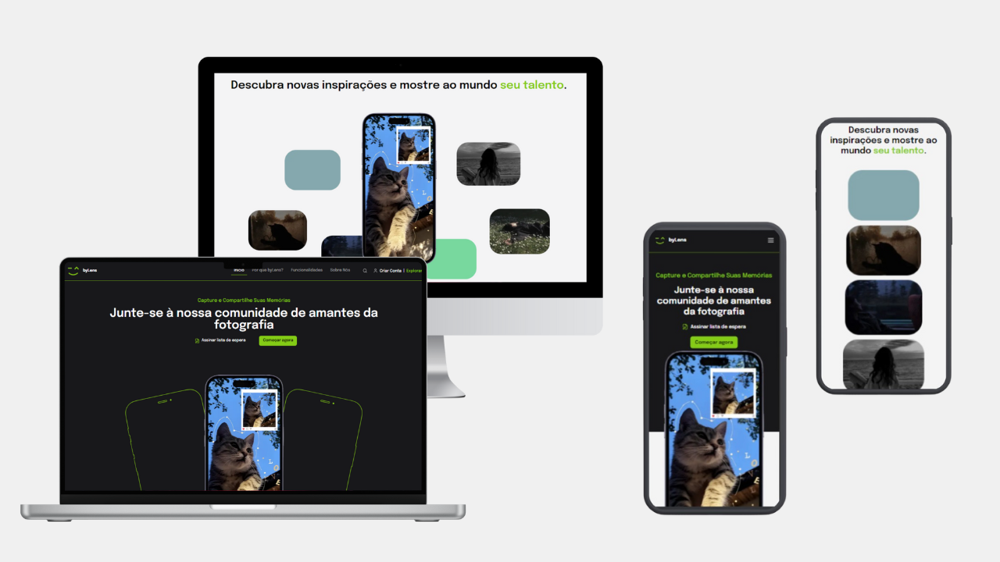

<h1 align="center">
    byLens
    
</h1>

  <a href="#-projeto">Projeto</a>&nbsp;&nbsp;&nbsp;|&nbsp;&nbsp;&nbsp;
  <a href="#-tecnologias">Tecnologias</a>&nbsp;&nbsp;&nbsp;|&nbsp;&nbsp;&nbsp;
  <a href="#memo-licença">Licença</a>

  

## 💻 Projeto

byLens trata-se de um projeto landing page sobre uma rede social para amantes da fotografia.

 

  

## 🚀 Tecnologias

Esse projeto foi desenvolvido com as seguintes tecnologias:

- NextJS
- TailwindCSS
- TypeScript
- GSAP
- Git e Github

## :memo: Licença

Esse projeto está sob a licença MIT.
